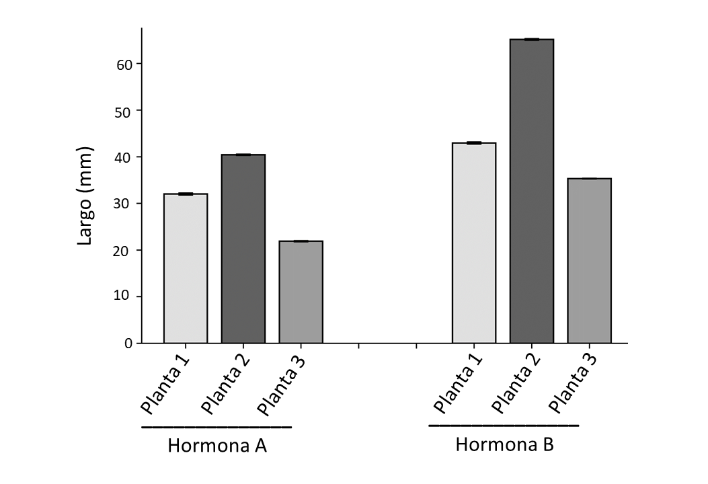

# Graficas
Graficas bonitas con matplotlib\
Nota: Los ejes de las gráficas después deben ser editadas en el procesador de textos de tu preferencia.

Otra nota: los datos están incompletos por algo, el proposito de este repositorio es compartir unicamente el codigo

## Ejemplo: Barras agrupadas con error (Plantas)
La imagen original es esta:

Pero despues de editarla en tu procesador de textos de preferencia, el resultado es este:

## Gráfica CHONS

## Gráfica humedad

## Gráfica cenizas

## Gráfica FVI

## Gráfica lignina

## Gráfica PCS teoricos vs PCS experimental

